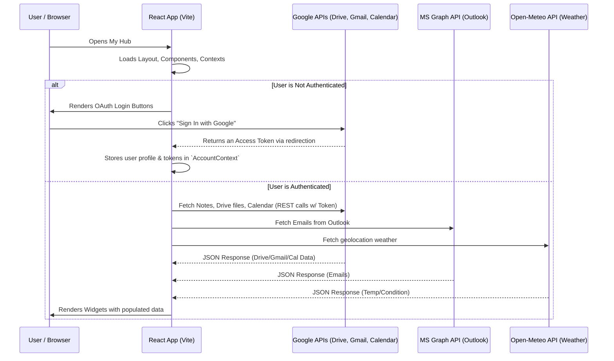
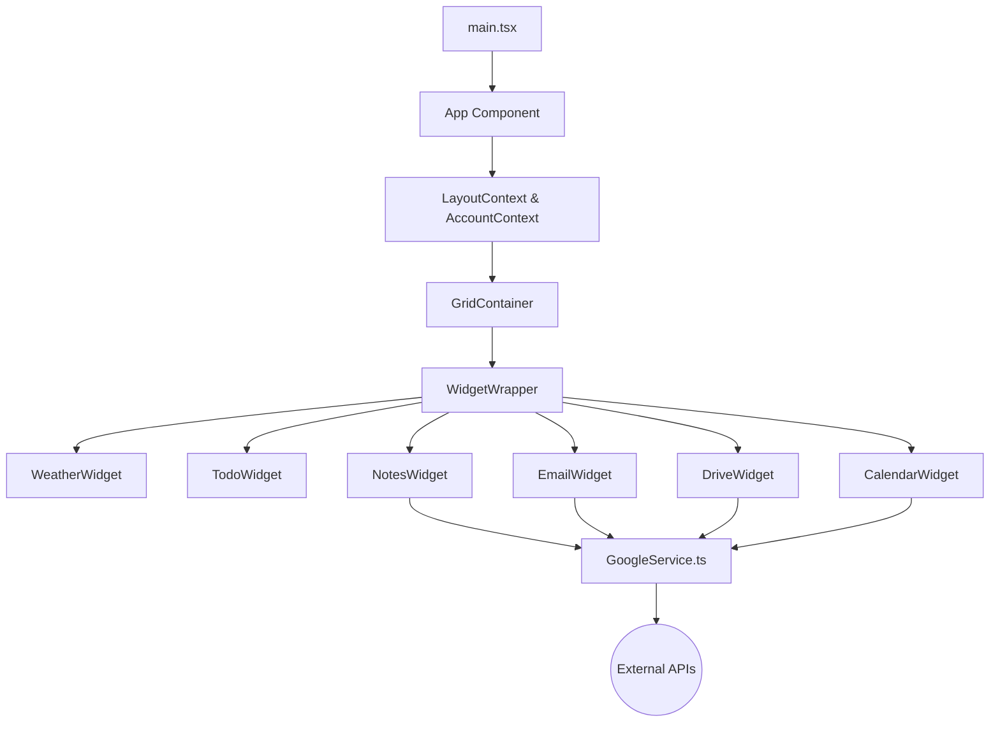

# Architecture & Technical Choices

This document details the architecture of the **My Hub** personal dashboard application, outlining exactly how the project is structured and justifying the technical decisions that drive its implementation.

## 1. System Architecture Diagram

The application is a pure front-end React SPA (Single Page Application) that communicates directly with external APIs using standard REST protocols securely. There is **no backend infrastructure**. This eliminates server costs and ensures maximum privacy since user tokens (Google, Microsoft) are kept locally in the browser memory and local storage.

## 2. Directory Structure & Data Flow

The app follows a clear separation of concerns using Context APIs for global state, Services for data fetching, and isolated components using CSS Modules.

## 3. Justification of Technical Choices

### Vite over Create React App or Next.js

- **Performance**: Vite provides incredibly fast Hot Module Replacement (HMR) and relies on ES Modules. This is perfect for a Dashboard that requires quick iterations during development.
- **Why not Next.js?**: SEO is irrelevant for a personal, private, authenticated dashboard. Next.js App Router and Server Components would add unnecessary deployment complexity. A simple Static Web App generated by Vite is the perfect fit.

### CSS Modules & Native CSS Variables vs Tailwind CSS

- **Dynamic Theming Engine**: One of the core features of the Dashboard is real-time customization (Live color changes, live border-radius dragging, Dark Mode). Tailwind shines for static utilities, but dynamic real-time CSS is best handled by injecting CSS Variables (`--color-primary`, `--radius-md`).
- **Isolation**: CSS Modules `Styles.container` guarantee that styling a specific widget (e.g., Weather card) won't accidentally leak and break the styling of another widget. This makes adding new widgets much safer. Adding Tailwind would mean mixing utility classes with hardcoded CSS variables, creating friction. Therefore, staying 100% vanilla CSS with Modules is the most coherent architectural choice for this specific feature set.

### React Grid Layout

- **Complex Grid Management**: Building a responsive drag-and-drop dashboard grid with overlapping prevention, collision, and auto-packing from scratch is incredibly error-prone. `react-grid-layout` provides a robust, battle-tested solution that integrates specifically well with React hooks.

### Google GIS & GAPI combination

- The project uses `Google Identity Services (GIS)` for modern authentication workflows, combined securely with the older `GAPI` (Google API Client Library) for executing the actual request calls seamlessly (Drive, Gmail, Calendar). Microsoft `MSAL` is used for Graph API interactions.

### Context API vs Redux

- **Simplicity**: The application needs to share minimal global state: Authentication tokens (`AccountContext`) and the grid/theme layout (`LayoutContext`). Redux or Zustand would be overkill for an app where 90% of the state is local data fetched per-widget.

### LocalStorage Persistence

- Both the grid layout coordinates (`x`, `y`, `width`, `height`), the dynamic CSS Theme, and the user's local tasks (Todo widget) are persisted automatically to the browser's `localStorage`. This guarantees the state is preserved between sessions trivially securely.
