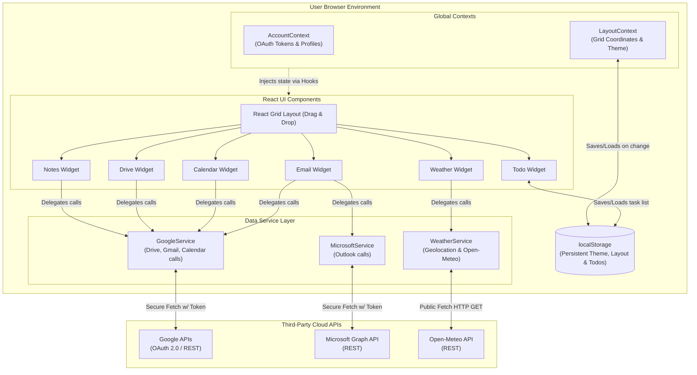
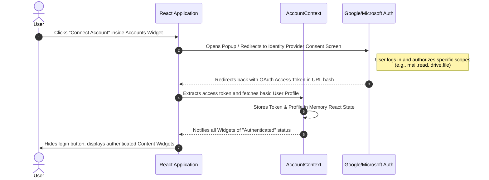
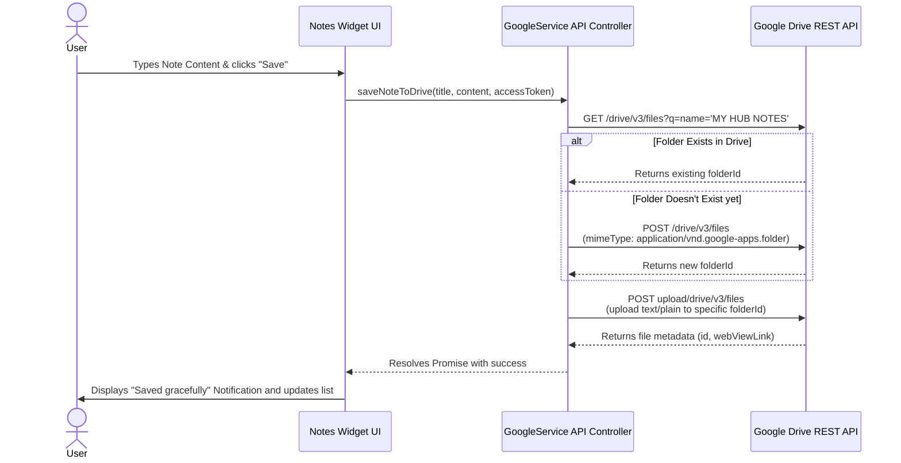

# Comprehensive Architecture Diagrams

This document contains a deep-dive visual explanation of the entire functioning of the App, including APIs, communications, state management, and the user interface.

## 1. High-Level System Architecture

This diagram shows the complete structure of the application, representing the boundaries between the user's browser, the application's internal structure (State, Services, Components), and external APIs.



## 2. Authentication Flow (OAuth)

The application handles authentication entirely on the client side without storing any credentials on an external database. Here is how the authentication handshake works with identity providers.



## 3. Dynamic Theming & Layout Engine

My Hub allows users to completely modify the look, feel, and structure of the dashboard in real time. This diagram explains how the Theme Engine leverages CSS variables and handles persistence.

```mermaid
graph LR
    User([User]) -->|Drags or Resizes Widget| RGL[React-Grid-Layout]
    RGL -->|Triggers layout update| LC[LayoutContext]
    LC -->|JSON Stringify| LS[(localStorage: 'hub_layout')]

    User -->|Changes setting in Theme Panel| TP[Theme Panel Component]
    TP -->|setCSSVar('--color-primary')| DOM[document.documentElement]
    TP -->|setCSSVar('--radius')| DOM
    TP -->|Saves configuration object| LC
    LC -->|JSON Stringify| LS2[(localStorage: 'hub_theme')]

    %% initialization path
    LS -.->|Initial App Load| LC
    LS2 -.->|Initial App Load| LC
    LC -.->|Applies stored styles| DOM
```

## 4. Complex Data Fetching Lifecycle (Example: Notes Widget)

This sequence diagram takes a deeper look at the granular API communication pattern used when an authenticated user performs an action, such as saving a note to their Google Drive.



## 5. Email Aggregation Flow

The email widget is a prime example of the combined capabilities of the app, fetching data simultaneously from two distinct providers and unifying them onto a single feed.

```mermaid
flowchart TD
    App((Email Widget))
    
    App -->|Requests unread emails| FetchGoogle[Call GoogleService]
    App -->|Requests unread emails| FetchMicrosoft[Call MicrosoftService]

    FetchGoogle -->|Using Google Token| G_API[Gmail API (/messages)]
    FetchMicrosoft -->|Using MSAL Token| M_API[Microsoft Graph API (/me/messages)]

    G_API -->|Returns Message List| ParserGoogle[Parse Gmail Format]
    M_API -->|Returns Message List| ParserMicrosoft[Parse Outlook Format]

    ParserGoogle --> Aggregator{Combine & Sort by Date}
    ParserMicrosoft --> Aggregator

    Aggregator --> Render[Render Unified Standardized Inbox UI]
```
